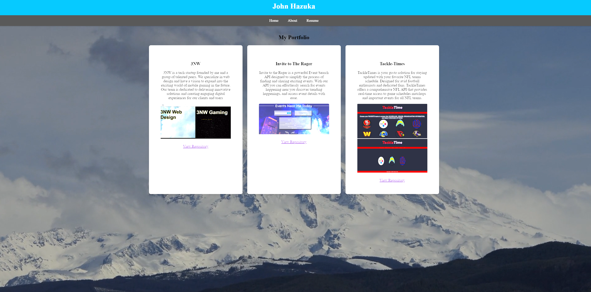

## React Portfolio
# Overview
This is a simple React portfolio showcasing my skills, projects, and information. The portfolio is designed to provide an overview of my background, projects, and contact details.

## Getting Started
Clone the Repository:

bash
Copy code
git clone https://github.com/JohnHazukaJr/portfolio.git
cd react-portfolio

## Install Dependencies:

bash
Copy code
npm install

## Run the Application:

bash
Copy code 
npm start
The portfolio should be accessible at http://localhost:5173/.

# Customization
Feel free to customize the portfolio to fit your style and preferences. Update the content, add new sections, or modify the styling to create a personalized representation of your work.

## Technologies Used
# React
# HTML
# CSS

## Author
John Hazuka https://github.com/JohnHazukaJr

# License
This project is licensed under the MIT License.

